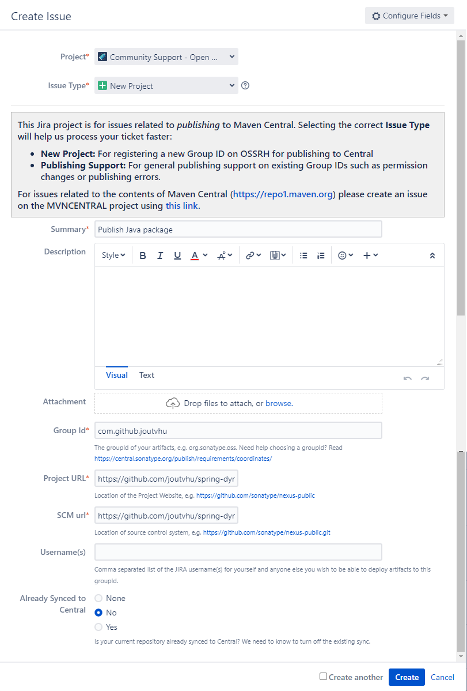
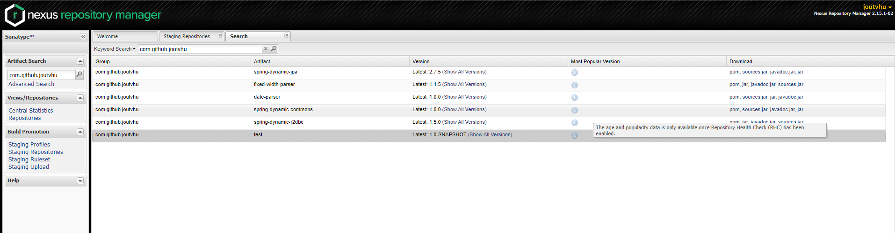

# Publish Java library to Maven Repository

## Create a JIRA Account and Request a Ticket

First, you will need to have a [Sonatype JIRA](https://issues.sonatype.org) account to open a new ticket to request your access to publish your artifact.

Then, create a JIRA ticket to fill your information.



You have to fill your domain name or use your github domain into Group Id field. Then prove ownership by adding a text record to your domain or create a repository with the specified name.

## Create a GPG key

You will also need a private key to sign the artifact.

- [Use Git](https://docs.github.com/en/authentication/managing-commit-signature-verification/generating-a-new-gpg-key)

- [Use Tool](https://www.openpgp.org/software/)

Publish your GPG certificate to key servers. Recommended: https://keyserver.ubuntu.com

## Save your Environment Variables

You can safely store your credentials into the .m2/settings.xml file in your
user's home directory.

```xml
<settings xmlns="http://maven.apache.org/SETTINGS/1.0.0"
          xmlns:xsi="http://www.w3.org/2001/XMLSchema-instance"
          xsi:schemaLocation="http://maven.apache.org/SETTINGS/1.0.0 https://maven.apache.org/xsd/settings-1.0.0.xsd">
    <servers>
        <server>
            <id>ossrh</id>
            <username>{ username }</username>
            <password>{ password }</password>
        </server>
    </servers>
    <profiles>
        <profile>
            <id>ossrh</id>
            <activation>
                <activeByDefault>true</activeByDefault>
            </activation>
            <properties>
                <gpg.executable>gpg</gpg.executable>
                <gpg.keyname>{ gpg-key }</gpg.keyname>
                <gpg.passphrase>{ gpg-passphrase }</gpg.passphrase>
            </properties>
        </profile>
    </profiles>
</settings>
```

## Set Up Maven in the Project

```xml
<modelVersion>4.0.0</modelVersion>
<groupId>com.github.joutvhu</groupId>
<artifactId>test</artifactId>
<version>1.0-SNAPSHOT</version>
<name>test</name>
<description>Test Lib</description>
<url>https://github.com/joutvhu/test</url>
<organization>
    <name>Giao Ho</name>
    <url>https://github.com/joutvhu</url>
</organization>
<licenses>
    <license>
        <name>MIT License</name>
        <url>https://github.com/joutvhu/test/blob/master/LICENSE</url>
    </license>
</licenses>
<developers>
    <developer>
        <id>joutvhu</id>
        <name>Giao Ho</name>
        <email>joutvhu@gmail.com</email>
    </developer>
</developers>
<scm>
    <connection>scm:git:git@github.com:joutvhu/test.git</connection>
    <developerConnection>scm:git:git@github.com:joutvhu/test.git</developerConnection>
    <url>https://github.com/joutvhu/test</url>
</scm>
<issueManagement>
    <system>Github Issue</system>
    <url>https://github.com/joutvhu/test/issues</url>
</issueManagement>
```

## Build Config

This will add the configuration for the build tag.

Add the following maven plugins:

```xml
<build>
    <plugins>
        <plugin>
            <groupId>org.apache.maven.plugins</groupId>
            <artifactId>maven-source-plugin</artifactId>
            <version>3.2.1</version>
            <executions>
                <execution>
                    <id>attach-sources</id>
                    <goals>
                        <goal>jar-no-fork</goal>
                    </goals>
                </execution>
            </executions>
        </plugin>
        <plugin>
            <groupId>org.apache.maven.plugins</groupId>
            <artifactId>maven-javadoc-plugin</artifactId>
            <version>3.4.1</version>
            <executions>
                <execution>
                    <id>attach-javadocs</id>
                    <goals>
                        <goal>jar</goal>
                    </goals>
                </execution>
            </executions>
            <configuration>
                <javadocExecutable>
                    ${java.home}/bin/javadoc
                </javadocExecutable>
            </configuration>
        </plugin>
        <plugin>
            <groupId>org.apache.maven.plugins</groupId>
            <artifactId>maven-surefire-plugin</artifactId>
            <version>2.22.2</version>
        </plugin>
        <plugin>
            <groupId>org.sonatype.plugins</groupId>
            <artifactId>nexus-staging-maven-plugin</artifactId>
            <version>1.6.13</version>
            <extensions>true</extensions>
            <configuration>
                <serverId>ossrh</serverId>
                <nexusUrl>https://oss.sonatype.org/</nexusUrl>
                <autoReleaseAfterClose>true</autoReleaseAfterClose>
            </configuration>
        </plugin>
        <plugin>
            <groupId>org.apache.maven.plugins</groupId>
            <artifactId>maven-gpg-plugin</artifactId>
            <version>3.0.1</version>
            <executions>
                <execution>
                    <id>sign-artifacts</id>
                    <phase>verify</phase>
                    <goals>
                        <goal>sign</goal>
                    </goals>
                </execution>
            </executions>
        </plugin>
    </plugins>
</build>
```

## Distribution Management Config

Add this child to the project's root:

```xml
<distributionManagement>
    <snapshotRepository>
        <id>ossrh</id>
        <url>https://oss.sonatype.org/content/repositories/snapshots</url>
    </snapshotRepository>
    <repository>
        <id>ossrh</id>
        <url>https://oss.sonatype.org/service/local/staging/deploy/maven2</url>
    </repository>
</distributionManagement>
```

## Uploading to Sonatype Repository

Add "-SNAPSHOT" if you will deploy to the snapshot repository. For example:

```
<version>1.0.0-SNAPSHOT</version>
```
or else:
```
<version>1.0.0</version>
```

Then run the following command to upload your library.

```sh
mvn deploy
```

Now go to https://oss.sonatype.org and login to check result.


